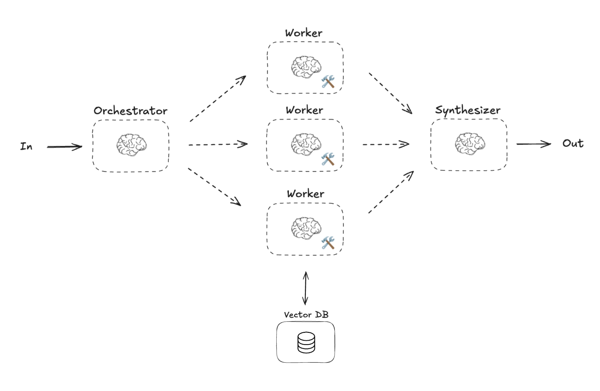

# Building Agents with LangGraph: From GPT to RAG and Multi-Agent Systems

This workshop is organized by [Visium](https://visium.ch/) for the [Applied Machine Learning Days (AMLD) 2025](https://2025.appliedmldays.org/) at EPFL. It demonstrates how to build sophisticated AI agents using LangChain and LangGraph frameworks.

## Workshop Overview
The workshop explores the progression from basic language models to complex multi-agent systems through hands-on examples in financial analysis.

### Part 1: Introduction to LangChain and RAG
Learn the basics of building AI applications with LangChain, including:
- Setting up a basic chatbot
- Understanding Retrieval Augmented Generation (RAG)
- Working with vector databases
- Creating custom tools
- Implementing a RAG-enhanced financial advisor

### Part 2: Building a Multi-Agent System



Explore more sophisticated AI applications using LangGraph:
- Creating specialized AI agents
- Managing state and workflow
- Implementing agent communication
- Building a complete financial analysis system with multiple agents

## Getting Started

### Prerequisites
- Python 3.11 or higher
- OpenAI API key

### Environment Setup

To set up your Python environment:

#### Using Conda/Mamba
```bash
# Use mamba instead of conda if preferred
conda create -n financial-advisor python=3.12
conda activate financial-advisor
pip install -e .
```

#### Using venv
```bash
python -m venv .venv

# On Linux/Mac:
source .venv/bin/activate
# On Windows:
.venv\Scripts\activate

pip install -e .
```

#### Using UV
```bash
uv sync
```

### Configuration

You'll need to configure your OpenAI API key. Here are two ways to do it:

Set it as an environment variable:
```bash
export OPENAI_API_KEY='your-api-key-here'
```

Or store it in a `.env` file in your project root:
```bash
OPENAI_API_KEY='your-api-key-here'
```

### Development Environment

This workshop uses Jupyter notebooks. You can run them using:

- VS Code with the Python extension installed
- Jupyter Lab through the web interface  with `jupyter lab`

## Workshop Structure
- `S1 - Introduction to LangChain and RAG.ipynb`: First session covering LangChain basics and RAG implementation
- `S2 - Building a Multi-Agent System.ipynb`: Second session exploring multi-agent systems with LangGraph

## Data
The workshop uses a curated set of Bloomberg financial news articles for demonstration purposes. The data is stored in `data/bloomberg_financial_news_1k.pkl`.

## About
### Visium
[Visium](https://visium.ch/) is a Swiss-born AI & Data company helping businesses build their data-driven future through artificial intelligence and advanced data analytics. We help organizations leverage cutting-edge technology to solve complex business challenges.

### AMLD
Applied Machine Learning Days (AMLD) is one of the largest machine learning and AI events in Europe, held annually at EPFL in Lausanne, Switzerland. For more information about AMLD 2025, visit [https://www.appliedmldays.org](https://www.appliedmldays.org).